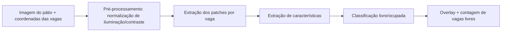
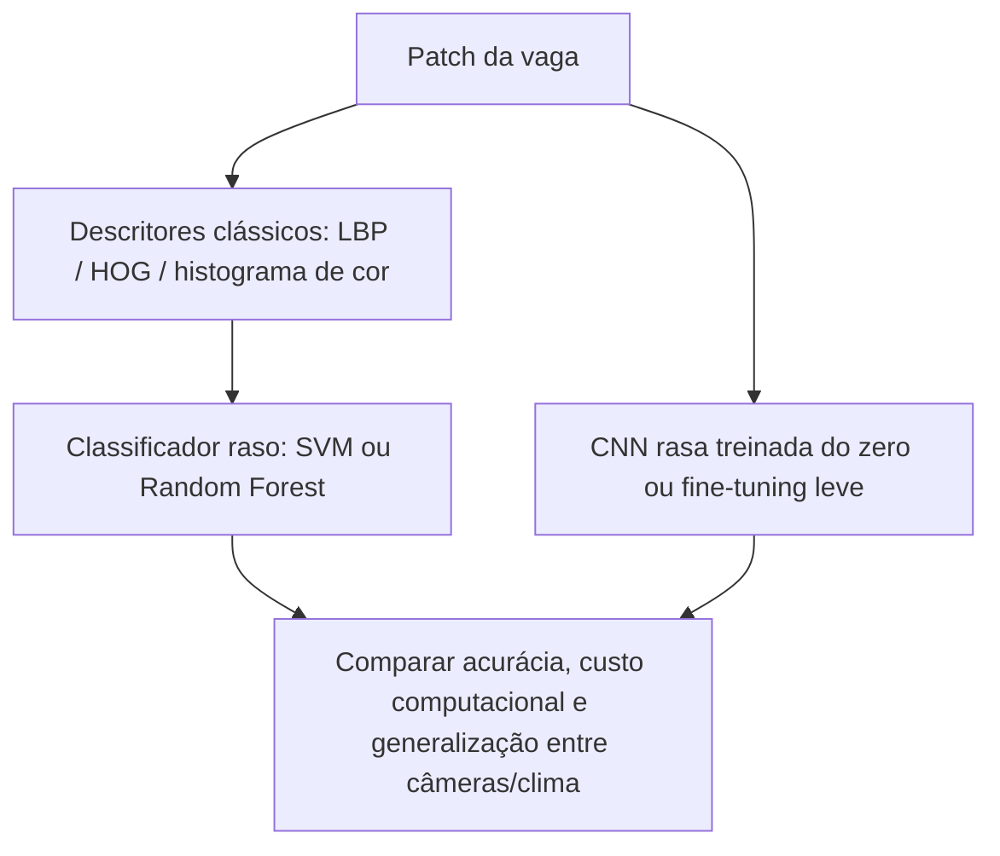
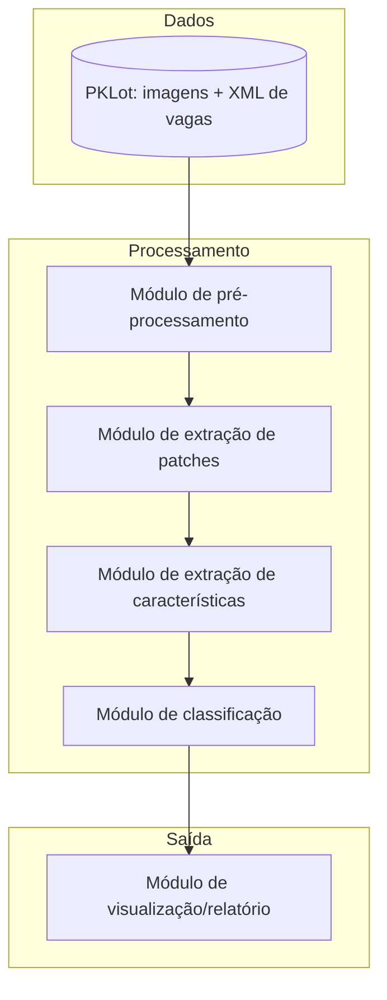

# Proposta — Detecção de Vagas de Estacionamento Livres/Ocupadas

> **Status:** M1 — definição do problema, investigação de viabilidade e planejamento técnico.
> **Disciplina:** Processamento de Imagens
> **Integrantes:** _(preencher nomes e e-mails/GitHub)_

---

## 1. Problema

O projeto investiga a **classificação automática do estado de vagas individuais em um estacionamento (livre ou ocupada) a partir de imagens capturadas por câmeras fixas** instaladas em posição elevada (ex.: topo de um prédio, poste, ou câmera de vigilância voltada para o pátio).

Situação inicial: uma câmera fixa fotografa periodicamente um estacionamento cujas vagas têm posição conhecida (ou podem ser delimitadas manualmente uma única vez, já que a câmera não se move). A situação de ocupação muda ao longo do tempo, entre imagens.

Informação a ser produzida: para cada vaga previamente delimitada em uma imagem, um rótulo binário — **livre** ou **ocupada** — e, de forma agregada, a contagem/percentual de vagas livres no pátio em um dado instante.

Evitando a formulação genérica que o enunciado desaconselha ("usar IA para reconhecer imagens"): aqui o que será **reconhecido é o estado de ocupação de uma região retangular/poligonal fixa da imagem que corresponde a uma vaga**, e o **contexto é um estacionamento monitorado por câmera fixa, sob variações de iluminação e clima**.

## 2. Contexto de aplicação

Sistemas de estacionamento inteligente ("smart parking") usam câmeras já instaladas (em vez de sensores por vaga, que são caros de instalar e manter) para informar em tempo real quantas vagas estão livres e onde. Aplicações concretas:

- Painéis de disponibilidade em entradas de estacionamentos de universidades, shoppings ou aeroportos;
- Redução do tempo gasto procurando vaga (e, consequentemente, de congestionamento e emissões dentro do pátio);
- Alimentação de aplicativos de navegação/reserva de vaga.

O projeto não pretende ser um produto comercial completo, mas usará um cenário real e bem documentado na literatura (estacionamentos monitorados por câmera), o que permite avaliar objetivamente a qualidade dos resultados (acurácia de classificação por vaga, por condição climática, por câmera).

## 3. Objetivo

**Objetivo geral:** dado um quadro (frame) de uma câmera de estacionamento e a delimitação espacial das vagas nesse quadro, classificar automaticamente cada vaga como *livre* ou *ocupada*.

**Objetivos específicos:**

1. Construir um pipeline de pré-processamento que normalize iluminação/contraste entre imagens capturadas em diferentes condições (sol, nublado, chuva);
2. Extrair, para cada vaga, o recorte (patch) correspondente à sua região na imagem;
3. Investigar e comparar ao menos duas abordagens de classificação do patch — uma baseada em descritores clássicos de textura/cor (ex.: LBP, HOG, histograma de cor) + classificador raso (SVM/Random Forest), e outra baseada em uma rede convolucional simples — para justificar tecnicamente a escolha que seguirá para M2;
4. Avaliar o efeito de fatores de generalização (câmera diferente, clima diferente) na acurácia do classificador, replicando um problema conhecido na literatura da área;
5. Produzir uma visualização de saída (overlay colorido sobre a imagem original: verde = livre, vermelho = ocupada) e uma contagem agregada de vagas livres.

## 4. Entrada e saída esperadas

**Entrada:**
- Uma imagem (frame) do estacionamento;
- A delimitação geométrica de cada vaga nessa imagem (retângulo rotacionado ou polígono de 4 pontos), fornecida junto ao dataset ou anotada manualmente para imagens próprias.

**Saída:**
- Um rótulo binário (`livre` / `ocupada`) por vaga, com um escore de confiança quando o classificador permitir;
- Uma imagem anotada com o contorno de cada vaga colorido conforme o estado previsto;
- Um resumo numérico (ex.: `42/60 vagas livres`).

Pipeline conceitual (será refinado na Seção 6):

```text
imagem + coordenadas das vagas
        ↓
pré-processamento (normalização de iluminação/contraste)
        ↓
extração dos recortes (patches) de cada vaga
        ↓
extração de características (clássica ou aprendida)
        ↓
classificação (livre / ocupada) por vaga
        ↓
agregação + visualização (overlay + contagem)
```

## 5. Imagens e dados

A viabilidade da proposta apoia-se no uso do **PKLot**, um dos datasets de referência da área, produzido pelo Laboratório VRI da Universidade Federal do Paraná (UFPR).

- **Origem:** imagens de estacionamentos reais da UFPR (dois pontos de captura, UFPR04 e UFPR05, no 4º e 5º andar de um prédio) e da PUCPR (10º andar), Curitiba/PR.
- **Forma de obtenção:** download público a partir da página oficial do dataset (VRI/UFPR) ou de espelhos redistribuídos sob a mesma licença (ex.: Hugging Face, Roboflow).
- O dataset contém 12.417 imagens completas do pátio, capturadas ao longo de mais de 30 dias em intervalos de 5 minutos, com 695.899 imagens de vagas individuais já recortadas e rotuladas.
- Cada imagem completa tem resolução padrão de 1280×720 pixels e é acompanhada de um arquivo XML com os polígonos de cada vaga monitorada e o respectivo estado de ocupação.
- Cada patch de vaga foi verificado e classificado manualmente quanto ao estado (livre/ocupada) e quanto à condição climática da captura (ensolarado, nublado ou chuvoso).
- **Restrições de uso / licença:** o dataset é distribuído sob licença Creative Commons Attribution 4.0, exigindo citação do artigo original do PKLot em publicações que o utilizem. O grupo não redistribuirá o dataset completo no repositório (por volume e por licença); o repositório conterá instruções de download e um subconjunto pequeno de exemplo em `images/input/` para reprodutibilidade dos experimentos iniciais.
- **Conjunto inicial já selecionado:** um recorte de algumas dezenas de imagens completas (uma amostra de cada condição climática e de pelo menos duas câmeras) para os experimentos preliminares da M1, disponível em `images/input/`.

Como dataset secundário de comparação/generalização (a ser avaliado na M2), o grupo também considera o **CNRPark-EXT**, que contém patches de vagas capturados por múltiplas câmeras em diferentes condições de luz, incluindo oclusões parciais por árvores e sombras de veículos vizinhos — útil para testar se um modelo treinado no PKLot generaliza para um cenário mais difícil.

## 6. Pipeline preliminar



Alternativas em investigação para a etapa de classificação (a decisão final será tomada com base nos experimentos preliminares e aprofundada na M2):



Detalhamento por etapa:

| Etapa | Finalidade | Entrada | Saída | Técnicas candidatas | Dúvidas em aberto |
|---|---|---|---|---|---|
| Pré-processamento | Reduzir variação de iluminação/clima entre capturas | Imagem bruta | Imagem normalizada | Equalização de histograma, correção gama, conversão para HSV/LAB | Qual normalização preserva melhor o contraste veículo/asfalto sob chuva? |
| Extração de patches | Isolar a região de cada vaga | Imagem + coordenadas (XML) | Recortes retificados por vaga | Perspective warp / recorte de retângulo rotacionado (OpenCV) | Vagas parcialmente ocluídas por veículos vizinhos: manter ou descartar? |
| Extração de características | Representar o patch numericamente | Patch da vaga | Vetor de características ou tensor | LBP, HOG, histograma de cor; alternativamente, features de uma CNN | Descritores clássicos bastam ou a variação visual exige aprendizado profundo? |
| Classificação | Decidir livre/ocupada | Características do patch | Rótulo + confiança | SVM, Random Forest, CNN rasa | Como tratar sombras que "imitam" a silhueta de um carro? |
| Agregação/visualização | Comunicar o resultado | Rótulos por vaga | Imagem anotada + contagem | Overlay colorido com OpenCV | Qual limiar de confiança sinalizar como "incerto" na visualização? |

## 7. Arquitetura preliminar



Organização de módulos prevista em `src/` (nomes provisórios): `preprocessing.py`, `patch_extraction.py`, `features.py`, `classifier.py`, `visualize.py`, além de `notebooks/` para experimentos exploratórios. A arquitetura é intencionalmente simples nesta etapa — módulos separados por responsabilidade, sem persistência em banco de dados, já que o escopo da M1 é validar a viabilidade técnica, não construir um sistema em produção.

## 8. Estudo inicial de viabilidade

Evidências reunidas até o momento:

1. **Maturidade do dataset:** o PKLot é amplamente usado em trabalhos publicados sobre classificação de vagas, com resultados de acurácia reportados na faixa de 93–98% em cenários controlados, o que indica que o problema é tratável com as técnicas clássicas de PDI e visão computacional propostas.
2. **Anotações prontas:** o dataset já fornece a delimitação geométrica de cada vaga e o rótulo de ocupação, eliminando a necessidade de anotação manual extensiva na M1 e permitindo que o grupo concentre esforço na etapa de classificação.
3. **Diversidade de condições:** a presença de subconjuntos sob sol, nublado e chuva, e de câmeras/pátios diferentes, permite desde já planejar experimentos de generalização (treinar em uma condição/câmera, testar em outra) — um eixo de investigação natural para a M2/M3.
4. **Inspeção manual preliminar:** o grupo baixou um pequeno subconjunto de imagens (ver `images/input/`) e confirmou visualmente que os limites das vagas fornecidos no XML se alinham corretamente com as vagas na imagem, e que a diferenciação visual entre vaga livre (asfalto) e ocupada (veículo) é perceptível a olho nu na maioria dos casos, mesmo sob nublado/chuva — casos de sombra e oclusão parcial aparecem como o principal desafio a ser tratado.
5. **Literatura de apoio:** artigos que usam PKLot e CNRPark-EXT descrevem exatamente o pipeline proposto (recorte de patch → descritor → classificador raso ou CNN), servindo de referência técnica direta.

## 9. Resultados/experimentos preliminares realizados

_A  preencher conforme os experimentos avancem — registrar aqui: imagem de entrada, método, parâmetros, saída e interpretação breve. Exemplos de experimentos simples já planejados: leitura e exibição de imagens do PKLot com overlay das coordenadas do XML; conversão para HSV e inspeção dos canais; teste de equalização de histograma sob a subamostra "rainy"._

## 10. Uso de Inteligência Artificial generativa

Uso de assistente de IA para estruturar esta proposta com base no enunciado da disciplina — o grupo revisou e ajustou objetivos, dataset e pipeline para refletir decisões próprias. Foi utilizado a IA para correções ortográficas e correções da estruta dos textos.

## 11. Referências

- ALMEIDA, P.; OLIVEIRA, L.; SILVA JR., E.; BRITTO JR., A.; KOERICH, A. **PKLot – A robust dataset for parking lot classification**. Expert Systems with Applications, 2015.
- AMATO, G. et al. **CNRPark-EXT**: dataset e trabalhos relacionados de classificação de ocupação de vagas via visão computacional.
- Página oficial do PKLot (VRI/UFPR) e réplicas públicas (Hugging Face `Voxel51/PKLot`, Roboflow `PKLot Object Detection Dataset`).
